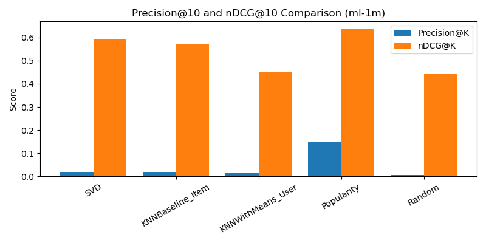

<link rel="stylesheet" href="assets/css/custom.css">

  <h1>Recommendations For You That Know <em>You</em></h1>
  

    Exploring how different recommender system models balance accuracy, ranking quality, novelty, and diversity
    using the MovieLens datasets.
  

  

    <strong>Student Researcher:</strong> Diya Rahul  
  

  Motivation
  <h2>Why this project?</h2>
  

    Recommender systems decide what we watch, listen to, and buy — but most systems are still evaluated by
    how closely they predict a user’s rating (metrics like RMSE or MAE). Prior work (e.g., Silveira et al., 2019)
    argues that rating error is a weak proxy for user satisfaction. A good system should also recommend items that
    are <strong>novel</strong>, <strong>diverse</strong>, and well-ranked in a Top-N list, not just accurate on past ratings.
  

  

    This project puts those ideas into practice by comparing different recommender models on the MovieLens data,
    looking beyond just accuracy and into how they rank and diversify recommendations.
  

  Research Question
  <h2>What am I asking?</h2>
  

    <strong>Developing metrics beyond accuracy to evaluate memory-based and model-based Collaborative Filtering models in their ability to balance predictive accuracy with diversity and novelty in movie recommendations.</strong>
  

  Data & Models
  <h2>Data and models used</h2>
  

    I use two public datasets from the MovieLens project (via the <code>surprise</code> Python library):
  

  <ul>
    <li><strong>MovieLens 100k</strong> – 100,000 ratings from 943 users on 1682 movies.</li>
    <li><strong>MovieLens 1M</strong> – 1,000,209 ratings from 6,040 users on 3,675+ movies.</li>
  </ul>
  
Models compared:

  <ul>
    <li><strong>SVD (matrix factorization)</strong> – learns hidden “taste” factors for users and movies.</li>
    <li><strong>KNNBaseline (item-based Pearson)</strong> – recommends items similar to what the user liked, using baseline-adjusted similarities.</li>
    <li><strong>KNNWithMeans (user-based cosine)</strong> – finds similar users and aggregates their ratings.</li>
    <li><strong>Popularity</strong> – always recommends the most frequently rated movies (a strong, simple baseline).</li>
    <li><strong>Random</strong> – recommends random movies (a lower bound for comparison).</li>
  </ul>

  Evaluation
  <h2>How do I evaluate them?</h2>
  
I split ratings into an <strong>80/20 train–test split</strong>:

  <ul>
    <li><strong>Train set</strong>: what the models learn from (known user–movie ratings).</li>
    <li><strong>Test set</strong>: held-out ratings used to evaluate accuracy.</li>
    <li><strong>Anti-testset</strong>: all user–movie pairs not seen in training, used to simulate “real” recommendations and build Top-10 lists.</li>
  </ul>

  <h3>Accuracy (rating error)</h3>
  <ul class="metrics-list">
    <li><strong>RMSE</strong> – Root Mean Squared Error between predicted and true ratings.</li>
    <li><strong>MAE</strong> – Mean Absolute Error.</li>
  </ul>

  <h3>Top-N ranking metrics (K = 10)</h3>
  <ul class="metrics-list">
    <li><strong>Precision@10</strong> – of the 10 recommended movies, what fraction are truly relevant (rating ≥ 4)?</li>
    <li><strong>Recall@10</strong> – of all a user’s relevant movies, how many appear in their Top-10?</li>
    <li><strong>HitRate@10</strong> – does each user get at least one relevant recommendation?</li>
    <li><strong>MAP@10</strong> – rewards relevant items that appear earlier in the list.</li>
    <li><strong>nDCG@10</strong> – measures overall ranking quality based on position and relevance.</li>
  </ul>

  <h3>Beyond accuracy (novelty & diversity)</h3>
  <ul class="metrics-list">
    <li><strong>Novelty</strong> – the average popularity rank of recommended items. Higher rank ⇒ less popular ⇒ more novel.</li>
    <li><strong>Coverage</strong> – how much of the catalog appears in any user’s Top-10 list.</li>
    <li><strong>ILD (Intra-List Diversity)</strong> – on MovieLens 100k, I use genre tags to measure how varied each Top-10 list is.</li>
  </ul>

  Key Results
  <h2>What did I find?</h2>
  

    Across both MovieLens 100k and 1M, SVD consistently achieves a strong balance between 
    <strong>rating accuracy</strong> and <strong>ranking quality</strong>:
  

  <ul>
    <li>SVD tends to have lower RMSE/MAE than the KNN-based models.</li>
    <li>On ranking metrics (Precision@10, MAP@10, nDCG@10), SVD generally outperforms KNNWithMeans and often KNNBaseline.</li>
    <li>The popularity baseline still achieves very high hit rates and strong nDCG, showing that popular items remain “safe” recommendations.</li>
  </ul>

  
Example ranking comparison on MovieLens 100k:

  

  
And on MovieLens 1M:

  

  

    These plots illustrate that accuracy alone doesn’t tell the full story: a model with similar RMSE values can still
    produce very different Top-10 recommendations in terms of relevance and variety.
  

  Tuning & Future Work
  <h2>Hyperparameter tuning and next steps</h2>
  

    I also tuned SVD on MovieLens 1M (varying the number of latent factors, epochs, and regularization) and measured
    how those choices impact both RMSE and ranking quality:
  

  

  

    Next steps include:
  

  <ul>
    <li>Exploring additional ranking metrics like nDCG@K under different K values.</li>
    <li>Looking at user-level trade-offs between accuracy and novelty (e.g., users who prefer more novel recommendations).</li>
    <li>Extending beyond movies to other entertainment domains such as music or streaming content.</li>
  </ul>

  Code
  <h2>Where to find the code</h2>
  

    All scripts for training models, computing metrics, and generating plots are available in this GitHub repository:
  

  

    🔗 <a href="https://github.com/diyarahul/recsys-movielens-research" target="_blank">
      github.com/diyarahul/recsys-movielens-research
    </a>
  

